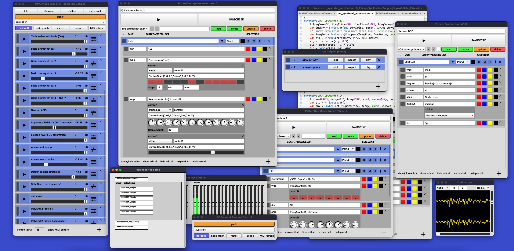

# SCM_caACLib  SCM Computer Aided Algorithmic Composition Library (SuperCollider)

## About

This library allows to perform algorithmic composition and digital sound synthesis, using flexible models and user interfaces. The most important aspect is the development of a flexible UI frontends entirely build with SuperCollider, to program and compose with the standard SuperColider Patterns library while being able to easily link view components to pattern input and external controllers using MIDI. I have added project and/or preset management support for the PatternBox & SynthBox. In addition to SC and DAW integration I added a new small tool that is called the ServerControlView, to make it easier to switch between audio interfaces.

In the class (.sc) source headers small examples are added.

This library is developed with **SuperCollider 3.12.1** and requires no extra external dependencies. 

## Links 

* [Documentation](https://docs.github.com/en/pages/setting-up-a-github-pages-site-with-jekyll/testing-your-github-pages-site-locally-with-jekyll)
* [Kanban boards](https://github.com/marinusklaassen/SCM_caACLib/projects?type=classic)

## Content Listing

- PatternBoxLauncher & PatternBox 
- SynthBox
- Patterns
- Widgets (views) 
  - SCMServerControlView
  - SCMPresetView
  - SCMProjectPersistanceView
  - PatternBox control widgets
- Custom drawn widgets 
- SC standard view factories
- Extensions (classes)
- Default presets
- Audio
- Image sprites

## Action Screenshots

## Status 

This is my main composition tool and is under active development. 

If you encounter any problems please feel free to file an issue.
