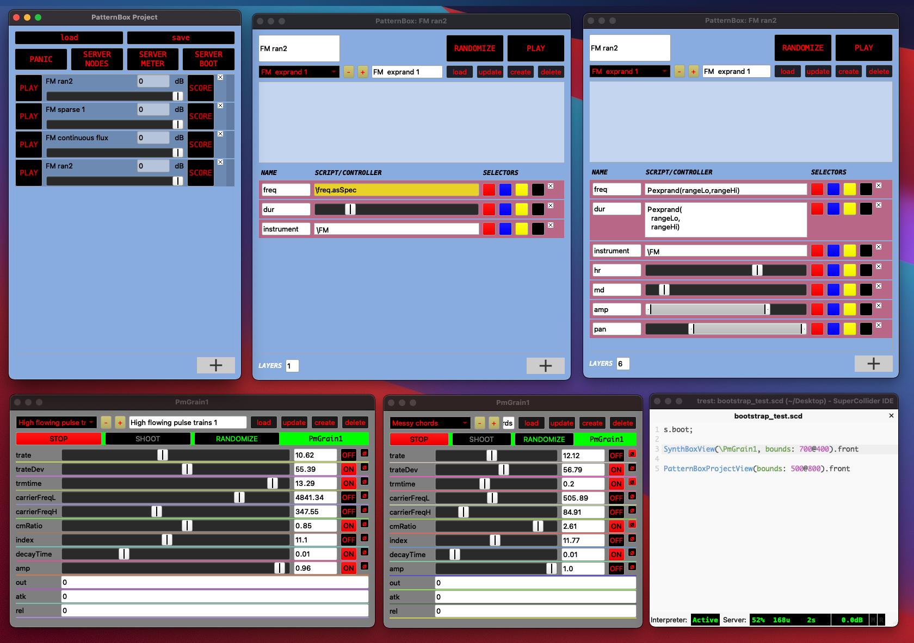

**SCM_caACLib - Computer Aided Algorithmic Composition Library (SuperCollider)**
---

**About**
---

SCM_caACLib is a library with various classes perform to algorithmic composition and digital sound synthesis, according to concepts and approaches towards flexible models and user interfaces. The most important aspect is the development of a flexible UI frontends progammed in sclang, to program and compose with patterns easy linking to external controllers, such as the Lemur app or MIDI. I have added project and/or preset management support for the PatternBox & SynthBox. 

In the .sc class source I added some examples. In the near future I am going to provide better examples, help documentation and tutorials. Meanwhile feel free to contact me via LinkedIn or GitHub if you need help or have any questions about this library.

**Contents**
---
 
- PatternBox 
- SynthBox
- Common patterns
- Common views
- Class extensions

**Dependencies**
---
  - SCLemurLib (optional) - Lemur autogui support will be added again during the next development phase.

**Screenshot**
---

**Status**
---

This library is under active development (again).

